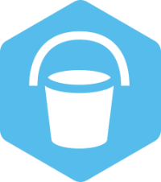
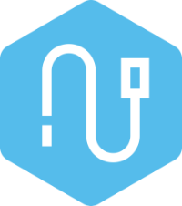

# c3kit — Clean Coders Clojure Kit

A family of small, composable Clojure / ClojureScript libraries for building
real applications: schemas, datastores, transport, build tooling. Each library
stands on its own and is published independently to Clojars under the
`com.cleancoders.c3kit` group.

This repository is a **meta-repo**. Each library lives in its own GitHub
repository and is mounted here as a git submodule for cross-module work.

| Module | Clojars | Build | Purpose |
|---|---|---|---|
| [**apron**](https://github.com/cleancoders/c3kit-apron) | [](https://clojars.org/com.cleancoders.c3kit/apron) | [](https://github.com/cleancoders/c3kit-apron/actions/workflows/test.yml) | Core utilities: app lifecycle, schema, log, time, util. JVM + Babashka + cljs. |
| [**bucket**](https://github.com/cleancoders/c3kit-bucket) | [](https://clojars.org/com.cleancoders.c3kit/bucket) | [](https://github.com/cleancoders/c3kit-bucket/actions/workflows/test.yml) | Unified entity-storage API: Datomic, JDBC, in-memory, IndexedDB. |
| [**wire**](https://github.com/cleancoders/c3kit-wire) | [](https://clojars.org/com.cleancoders.c3kit/wire) | [](https://github.com/cleancoders/c3kit-wire/actions/workflows/test.yml) | HTTP / transport for rich-client web apps. Ships `wire` (Reagent) and `wire-core` (React-free). |
| [**scaffold**](https://github.com/cleancoders/c3kit-scaffold) | [](https://clojars.org/com.cleancoders.c3kit/scaffold) | [](https://github.com/cleancoders/c3kit-scaffold/actions/workflows/test.yml) | Build / test runner for ClojureScript SPAs and Garden-based CSS. |

[](https://opensource.org/licenses/MIT)

[](https://github.com/cleancoders/c3kit-apron)
[](https://github.com/cleancoders/c3kit-bucket)
[](https://github.com/cleancoders/c3kit-wire)
[](https://github.com/cleancoders/c3kit-scaffold)

## Installing

Each library publishes independently. Pull only what you need:

```clojure
;; deps.edn
{:deps {com.cleancoders.c3kit/apron    {:mvn/version "2.7.0"}
        com.cleancoders.c3kit/bucket   {:mvn/version "2.13.1"}
        com.cleancoders.c3kit/wire     {:mvn/version "4.0.0"}    ;; or wire-core
        com.cleancoders.c3kit/scaffold {:mvn/version "2.3.4"}}}
```

```clojure
;; project.clj
[com.cleancoders.c3kit/apron "2.7.0"]
```

`apron` is the foundation — `bucket`, `wire`, and `scaffold` depend on it.

## Working in this repo

```bash
git clone git@github.com:cleancoders/c3kit.git
cd c3kit
git submodule update --init
```

Most real work happens **inside a submodule**. Each submodule has its own
`README`, `CHANGES.md`, `CONTRIBUTING.md`, test setup, and release process.

```bash
cd apron
clj -M:test:spec
```

The `bin/` directory has fan-out helpers for cross-module operations
(`bin/pullall.sh`, `bin/pushall.sh`, `bin/testall.sh`). For agent-oriented
context on the meta-repo workflow, see [`AGENTS.md`](AGENTS.md).

## Releasing

Each library releases independently to Clojars. There is no synchronised
release across the family. See [`DEPLOY.md`](DEPLOY.md) for the full per-module
release flow.

## Contributing

We welcome contributions. Before opening a pull request please:

1. Read the meta-repo [`CONTRIBUTING.md`](CONTRIBUTING.md) for repo conventions.
2. Read the **target submodule's** `CONTRIBUTING.md` — each library has its
   own test commands and release notes.
3. Open or find an issue first. PRs without a linked, maintainer-acknowledged
   issue are auto-closed.

This project follows the [Contributor Covenant Code of Conduct](CODE_OF_CONDUCT.md).
By participating you agree to abide by it.

## Security

Please report security issues privately. See [`SECURITY.md`](SECURITY.md) for
how to reach us — do not open a public issue.

## License

[MIT](LICENSE) © Clean Coders.
